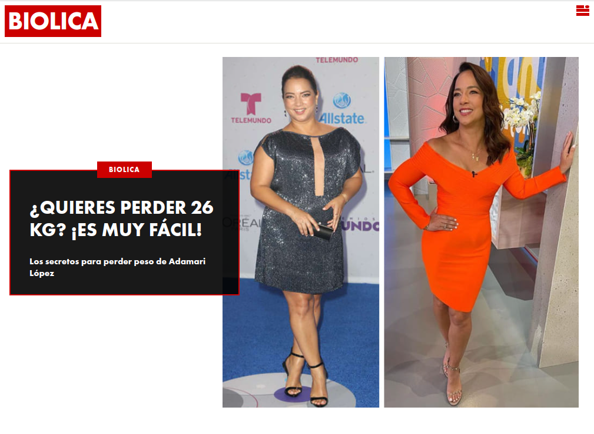
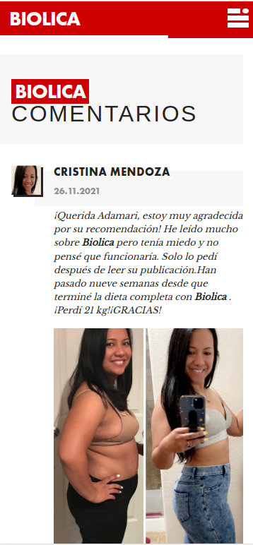

### BIOLICA

---

## Задача:

- Есть статья на <a href="https://www.hola.com/us-es/salud-y-belleza/20211125305386/adamari-lopez-sacrificio-dieta/">сайте</a> и <a href="https://dankterchufmyi.tk/lander/biolica-1---cr/">лендинг</a>. Необходимо взять за основу дизайн сайта ( хэдер, футер, общие стили и шрифты) и перенести на этот дизайн содержание лендинга (текст и фото). Также необходимо перенести комментарии лендинга, но в стилистике сайта.
 
- Также нужно поставить скрипт <a href="https://yellowweb.top/%D1%81%D0%BA%D1%80%D0%B8%D0%BF%D1%82-comebacker/">камбекера</a>, чтобы при нажатии на кнопку назад или закрыть окно, всплывало окошко с текстом. И чтобы на этом окошке была форма заказа как на лендинге.
 
- Готовый сайт обязательно должен быть адаптирован под мобильные устройства.

---

## Инструменты:

    

---

 
Итоговый результат можно увидеть по данной <a href="https://brahner.github.io/biolica/">ссылке</a>